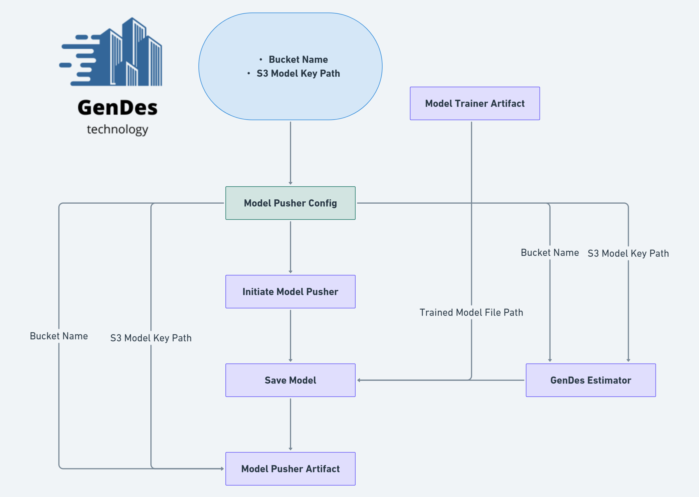

# GenDes Subscription Renewal Prediction Project-


## Overview
The GenDes Subscription Renewal Prediction Project aims to develop a machine learning model to predict subscription renewals at GenDes, a fictional company at the forefront of using generative AI for 3D home design. This project includes the complete lifecycle of a machine learning project, from understanding the problem to deploying a model that can predict customer behaviors.

## About GenDes
GenDes is a hypothetical company designed to explore how generative AI can revolutionize 3D home design. By offering cutting-edge tools, GenDes enables both professionals and hobbyists to effortlessly bring their visions to life. This scenario models real-world business challenges and data analytics in a subscription-based service domain.

## Problem Statement
With the increasing difficulty of manually predicting subscription renewals due to growth in user base, GenDes aims to automate the prediction of renewal outcomes using machine learning. This model will help identify users at risk of not renewing their subscriptions and allow the company to develop targeted retention strategies.

## Data Collection
The dataset is a fabricated representation of user interactions and subscription data at GenDes, created to emulate real-world customer behavior and renewal outcomes. The dataset includes the following fields:

| Column Name                   | Description                                                          |
|-------------------------------|----------------------------------------------------------------------|
| `CustomerID`                  | Unique identifier for each customer.                                 |
| `Country`                     | The country where the customer resides.                              |
| `user_education`              | The highest level of education achieved by the customer.             |
| `Gender`                      | The gender of the customer.                                          |
| `UsesAdvancedFeatures`        | Indicates whether the customer uses advanced features (Y/N).         |
| `AppEngagementSeconds`        | Total number of seconds the customer has engaged with the app.       |
| `LastLoginDaysAgo`            | Number of days since the customer last logged into the app.          |
| `Profession`                  | The customer's profession.                                           |
| `SubscriptionType`            | Type of subscription the customer has chosen.                        |
| `UsesVR`                      | Indicates whether the customer uses VR features (Y/N).               |
| `RenewSubscription`           | Indicates whether the customer has renewed their subscription (Y/N). |
| `Age`                         | Age of the customer.                                                 |
| `DesignProjectScale`          | Scale of design projects the customer is involved in.                |
| `NumberOfDesigns`             | Number of designs the customer has created.                          |
| `TutorialProgressionType`     | Level of tutorial progression completed by the customer.             |
| `FrequencyOfDesignToolUsage`  | Frequency of design tool usage by the customer.                      |
| `CustomerSupportCall`         | Indicates if the customer has called support (Y/N).                  |


## Project Structure

The project is structured as follows:

```bash
AI4RENEWALS-GENDES
│
├── .github/workflows
│   └── aws.yaml
├── AI4Renewals
│   ├── cloud_storage
│   │   └── aws_storage.py
│   ├── components
│   │   ├── data_ingestion.py
│   │   ├── data_transformation.py
│   │   ├── data_validation.py
│   │   ├── model_evaluation.py
│   │   ├── model_pusher.py
│   │   └── model_trainer.py
│   ├── configuration
│   │   ├── aws_connection.py
│   │   └── mongo_db_connection.py
│   ├── constant
│   │   └── __init__.py
│   ├── data_access
│   │   └── ai4renew_data.py
│   ├── entity
│   │   ├── artifact_entity.py
│   │   ├── config_entity.py
│   │   ├── estimator.py
│   │   └── s3_estimator.py
│   ├── exception
│   │   └── __init__.py
│   ├── logger
│   │   └── __init__.py
│   ├── pipeline
│   │   ├── prediction_pipeline.py
│   │   └── training_pipeline.py
│   └── utils
│       └── main_utils.py
│
├── artifact
├── config
│   ├── model.yaml
│   └── schema.yaml
├── Designs
├── logs
├── Notebooks
│   ├── dataset.csv
│   ├── EDA.ipynb
│   └── Feature_Engineering_and_Model_Training.ipynb
│   
├── static
│   ├── css
│   │   └── style.css
│   └── logo.png
├── templates
│   └── gendes.html
│
├── .dockerignore
├── .gitignore
├── app.py
├── demo.py
├── Dockerfile
├── LICENSE
├── README.md
├── requirements.txt
├── setup.py
└── template.py
```
## Components

### Data Ingestion


The Data Ingestion component is responsible for the initial handling of data as it enters the machine learning pipeline. The process involves the following key steps:

- **Configuration Retrieval**: Initializes the ingestion process by loading the data ingestion configurations, which include parameters like directory paths, file names, and the train-test split ratio.

- **Exporting Data from MongoDB**: Connects to MongoDB to export the data into a DataFrame, leveraging the `GenDesData` class for database operations. This data is considered raw and unprocessed.

- **Data to Feature Store**: Saves the extracted data to a feature store as a CSV file, creating the necessary directories if they don't already exist. The feature store serves as a centralized repository for ML features.

- **Train-Test Split**: Applies a train-test split to the data based on the predefined ratio, ensuring that both datasets are representative and isolated from each other.

- **File Export**: The split data are then saved as separate CSV files - `train.csv` for training and `test.csv` for testing. These files are stored at specified locations and are ready to be used in subsequent stages of the pipeline.

- **Data Ingestion Artifact Creation**: Finally, an artifact is created containing the paths to the training and testing datasets. This artifact serves as a reference to the processed data and ensures traceability throughout the ML lifecycle.


### Data Validation


The Data Validation component ensures the quality and consistency of the data before it is used for model training. The main steps involved in this component are:

- **Configuration & Schema Loading**: Utilizes the Data Validation configuration and a predefined schema to determine the expected structure of the dataset.

- **Column Validation**: Confirms that the dataset contains the correct number of columns as defined in the schema. It ensures that no required columns are missing from the dataset.

- **Existence Check**: Verifies the presence of all specified numerical and categorical columns. It identifies any discrepancies between the dataset and the schema definition.

- **Dataset Drift Detection**: Implements drift detection to compare the statistical distribution of the training dataset against new data. This is crucial for identifying any significant changes that might impact the model's performance.

- **Report Generation**: Creates a detailed drift report which includes metrics on the number of features assessed and the number of features that have drifted. This report is saved to a specified path and is used for further analysis and decision-making.

- **Data Validation Artifact Creation**: Constructs an artifact capturing the results of the validation process, including the validation status and any error messages. This artifact is a cornerstone for maintaining traceability and accountability in the ML pipeline.

- **Error Handling**: In case of any failure or inconsistency in the data, it captures detailed error logs to facilitate troubleshooting and corrective actions.

The Data Validation component is a critical safeguard that helps maintain the integrity of the machine learning pipeline, ensuring that only data which meets the required standards is allowed to flow through to the subsequent stages.


### Data Transformation


The Data Transformation component is a crucial stage that prepares raw data for model training by applying various preprocessing steps. This process is outlined in the following key steps:

- **Schema Configuration**: The transformation process begins by loading the schema configuration, which guides the transformation rules and procedures.

- **Preprocessing Pipeline**: Constructs a pipeline using `ColumnTransformer` that includes:
  - `OneHotEncoder` for categorical features.
  - `OrdinalEncoder` for ordinal features, with predefined ordering.
  - `PowerTransformer` for transforming skewed features to more Gaussian-like distributions.
  - `StandardScaler` for numerical features to normalize their scale.

- **Feature Engineering**: Enhances features by calculating new fields such as `AppEngagementMinutes` and determining if a user is active with `IsActive`.

- **Data Cleaning**: Drops unnecessary or redundant columns from the datasets as specified by the schema configuration.

- **Data Balancing**: Addresses class imbalance using `SMOTEENN` to apply synthetic minority oversampling and clean samples using under-sampling.

- **Transform & Resample**: Applies the preprocessing pipeline to the training and testing datasets and resamples them to handle class imbalance.

- **Transformation Artifacts**: Generates artifacts that include the transformed datasets and the preprocessing pipeline object, ensuring that the exact transformations can be applied to new data.

- **Validation Integration**: Ensures that data transformations are only applied to validated datasets, preserving the integrity of the data pipeline.

By automating the data transformation process, this component ensures that the data fed into the model is clean, balanced, and appropriately preprocessed for optimal model performance.


### Model Training


The Model Training component is designed to train and evaluate machine learning models systematically. This component automates the selection of the best-performing model according to predefined metrics. The process consists of several key steps:

- **Model Selection**: Utilizes the `ModelFactory` module from the `neuro_mf` library, which reads a configuration file to determine candidate models and their hyperparameters.

- **Training and Evaluation**: Splits the processed data into features and labels, then trains multiple models to select the best one based on a predefined expected accuracy threshold.

- **Metrics Calculation**: Once the best model is selected, it calculates key classification metrics such as accuracy, F1 score, precision, and recall on the test dataset.

- **Artifact Generation**: Creates a `ModelTrainerArtifact` that encapsulates the trained model's file path and the performance metrics.

- **Model Persistence**: Saves the trained model object along with the preprocessing pipeline, ensuring that the entire prediction pipeline can be recreated or deployed.

- **Validation Check**: Ensures that the final model's performance exceeds the expected accuracy; otherwise, it raises an exception, prompting a review of model configurations or data quality.


### Model Evaluation


The Model Evaluation component is essential to ensure that the newly trained models meet or exceed the performance of models currently in production. It involves the following critical steps:

- **Best Model Retrieval**: Fetches the current best model from production storage, from an S3 bucket, and prepares it for comparison with the newly trained model.

- **Model Comparison**: Evaluates the newly trained model against the current best model based on the F1 score, a balanced metric for binary classification models.

- **Model Selection**: Determines whether the newly trained model outperforms the current best model. If so, it may be promoted to production.

- **Artifact Creation**: Generates a `ModelEvaluationArtifact` that includes:
  - A flag indicating if the new model is accepted.
  - The path to the model in the S3 bucket.
  - The path to the newly trained model.
  - The change in accuracy (F1 score) between the models.

- **Model Update Decision**: If the new model's F1 score is higher than that of the model in production, it is marked for update; otherwise, the current best model remains in production.

- **Feature Engineering for Evaluation**: Applies the same feature engineering steps to the test dataset that were applied during training to ensure consistency.

- **Logging and Exception Handling**: Throughout the process, detailed logging captures the flow and outcome, and any exceptions are carefully handled to ensure the robustness of the evaluation process.


### Model Deployment (Model Pusher)




The Model Pusher is the last step in the machine learning pipeline, where the newly trained and evaluated model is deployed to production if it outperforms the existing model. This component encapsulates the following steps:

- **S3 Integration**: Utilizes AWS S3 services to store the machine learning model artifacts. Ensures that the model, once accepted, is accessible for production use.

- **Model Deployment**: If the model is deemed acceptable by the evaluation process, this component handles the uploading of the model to a designated S3 bucket.

- **Estimator Wrapping**: Incorporates the `GenDesEstimator` class, which abstracts away the details of interacting with S3, providing methods to easily save and retrieve models.

- **Artifact Creation**: Generates a `ModelPusherArtifact`, which contains references to the S3 bucket and model path, to log and trace the deployment action.

- **Logging and Error Handling**: Detailed logging captures the status and progress of the deployment process, while exceptions are managed to ensure consistent and reliable deployment operations.

By the end of this step, the machine learning pipeline has a new, operational model in production, or it retains the existing model if the new one does not meet performance expectations.

This automated process ensures that the model deployment is seamless and traceable, maintaining the production system's efficiency and accuracy.


## Setup and Installation

### Prerequisites
Before you begin the installation process, ensure you have the following:
- An Anaconda distribution of Python 3.8 or higher
- Git for cloning the repository
- Access to a terminal or command-line interface

### Installation Steps

1. **Clone the Repository:**
Clone the GenDes repository to your local machine using Git:

```bash
git clone https://github.com/aifreak00/End_To_End_Subscription_Renewal_Prediction.git
cd AI4Renewals-GenDes
```

Create and Activate a Conda Environment:

```bash
conda create -n gendes_env python=3.8 -y
conda activate gendes_env
```

Install Dependencies:

```bash
pip install -r requirements.txt
```


2. **AWS Services Setup**

**AWS Configuration**

AWS Console Setup:

**Log in to the AWS Console and perform the following:**

- Create an IAM User for Deployment
- Assign the following policies for necessary access:
- AmazonEC2ContainerRegistryFullAccess for ECR access.
- AmazonEC2FullAccess for EC2 access.
- AmazonS3FullAccess for S3 access.


**Create an S3 Bucket:**

Navigate to the Amazon S3 service and create a bucket:

- Bucket Name: ai4renew-model2024
- Region: Select your preferred AWS region
- Permissions: Ensure the bucket is accessible to your IAM user.

**Create an ECR Repository:**

Navigate to the Amazon ECR service and create a new repository. Note the URI:

**e.g., 136566696263.dkr.ecr.us-east-1.amazonaws.com/gendes_ecr**


**Launch an EC2 Instance:**

Select an Ubuntu Server, configure security groups for necessary access (SSH, HTTP).


**Install Docker on EC2:**

```bash
sudo apt-get update -y
sudo apt-get upgrade -y
curl -fsSL https://get.docker.com -o get-docker.sh
sudo sh get-docker.sh
sudo usermod -aG docker $USER
newgrp docker
```


3. **MongoDB Setup**

- Create a MongoDB Database
- You can use MongoDB Atlas or a local MongoDB installation.
- Set up a new database and take note of the connection string.
- Load dataset.csv to MongoDB


Configure Environment Variables:

**Before running the application, set up the necessary environment variables:**

```bash
export MONGODB_URL="mongodb+srv://<username>:<password>@<cluster-url>"
export AWS_ACCESS_KEY_ID="<Your_AWS_Access_Key_ID>"
export AWS_SECRET_ACCESS_KEY="<Your_AWS_Secret_Access_Key>"
```

4. **Running the Application**

- Ensure MongoDB and AWS services are properly configured before running the application
- To utilize the GenDes application effectively, follow these steps:

Begin by running the `demo.py` script. This will train the model and automatically upload the trained model to an AWS S3 bucket for storage and future retrieval.

```bash
python demo.py
```

```bash
python app.py
```


## AWS CI/CD Deployment with GitHub Actions

**Configure EC2 as a Self-Hosted Runner**

In your GitHub repository settings under Actions > Runners, add your EC2 instance as a new self-hosted runner following the provided instructions.


**Set Up GitHub Secrets**

Add the following secrets in your GitHub repository settings under Secrets:

- AWS_ACCESS_KEY_ID: Your IAM user's access key.
- AWS_SECRET_ACCESS_KEY: Your IAM user's secret access key.
- AWS_DEFAULT_REGION: Your AWS default region (e.g., us-east-1).
- CR_REPO: The URI of your ECR repository.


**Define the CI/CD Workflow**

.github/workflows/aws_cicd.yml file to automate the deployment:


- Build the Docker image.
- Push the image to ECR.
- Deploy the image to the EC2 instance.

